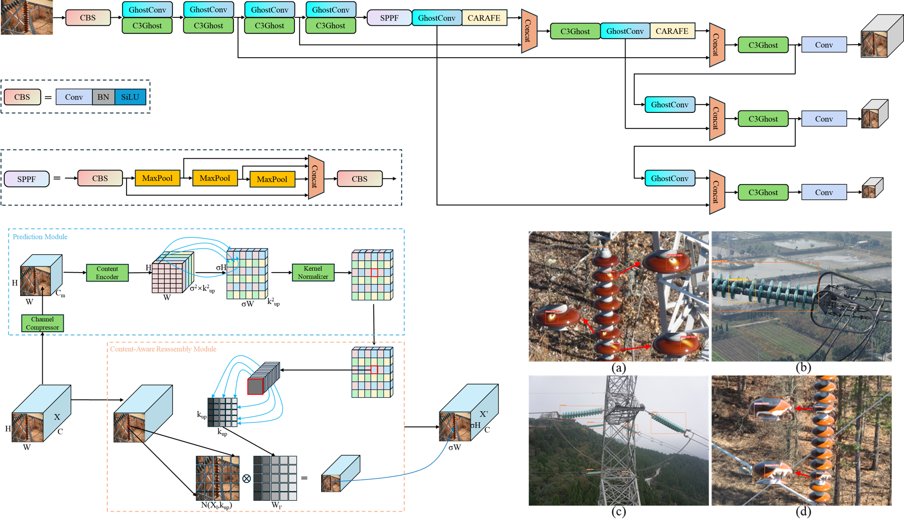

<div align="left">

# <div align="center">IDD-YOLOv5: A Lightweight Insulator Defect Real-time Detection Algorithm</div>

## Introduction
This is our PyTorch implementation of the paper "[`IDD-YOLOv5: A Lightweight Insulator Defect Real-time Detection Algorithm`](https://doi.org/10.1109/icma61710.2024.10632897)" published in ***2024 IEEE International Conference on Mechatronics and Automation (ICMA)***.

<div align="center">
    
</div>

## <div align="left">Quick Start Examples</div>

<details open>
<summary>Install</summary>

First, clone the project and configure the environment.
[**Python>=3.7.0**](https://www.python.org/), [**PyTorch>=1.7**](https://pytorch.org/get-started/locally/).

```bash
git clone https://github.com/LuYang-2023/ICMA2024.git  # clone
cd ICMA2024
pip install -r requirements.txt  # install
```
</details>

<details open>
<summary>Train</summary>


```python
python train.py --cfg models/IDD-yolov5.yaml --data data/insulator_detection.yaml
```
</details>


<details>
<summary>Test</summary>


```bash
python val.py --data data/mydata.yaml --weights best.pt --task test
```
</details>


### Citation
If you use this code or article in your research, please cite it using the following BibTeX entry:

```bibtex
@INPROCEEDINGS{10632897,
  author={Lu, Yang and Li, Dahua and Gao, Qiang and Yu, Xiao and Li, Xuan and Bai, Zhongli},
  booktitle={2024 IEEE International Conference on Mechatronics and Automation (ICMA)}, 
  title={IDD-YOLOv5: A Lightweight Insulator Defect Real-time Detection Algorithm}, 
  year={2024},
  volume={},
  number={},
  pages={491-495},
  keywords={YOLO;Adaptation models;Accuracy;Power transmission lines;Insulators;Real-time systems;Neck;Defect detection;Insulator;Lightweight;Deep learning;YOLOv5},
  doi={10.1109/ICMA61710.2024.10632897}}
```


## Author's Contact
Email：yj20220275@stud.tjut.edu.cn
